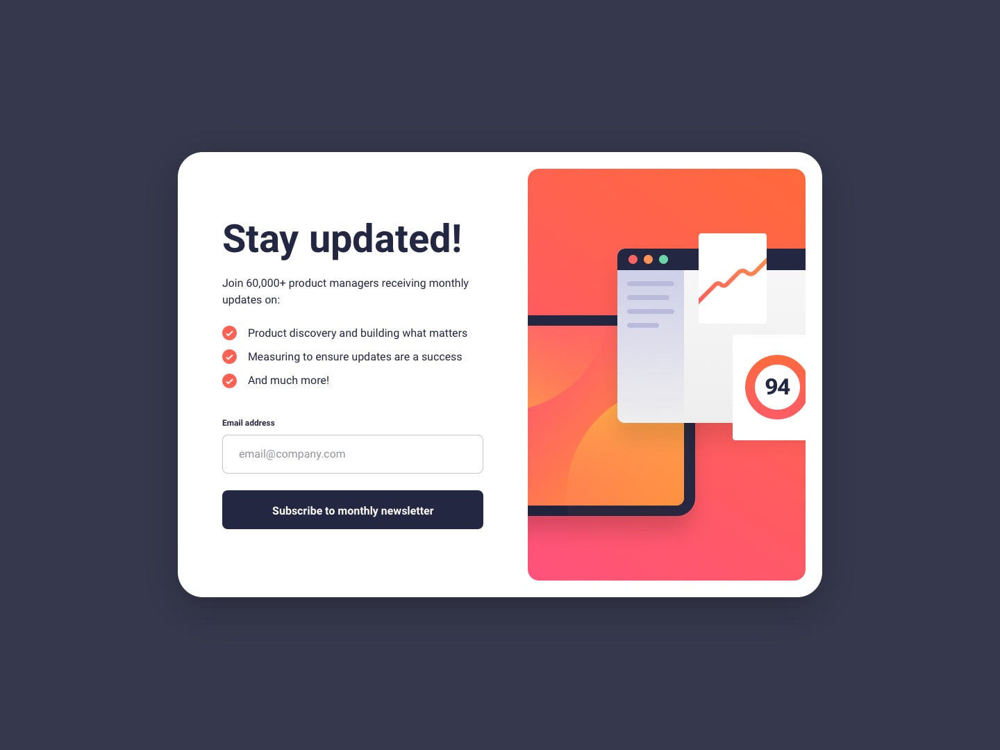
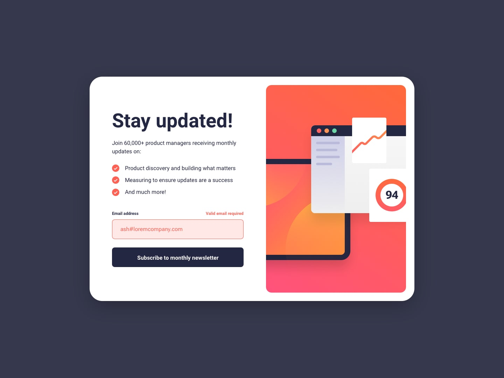

# Frontend Mentor - Newsletter sign-up form with success message


## 📋 Overview

### The Challenge

Users should be able to:

- ✅ Add their email and submit the form
- ✅ See a success message with their email after successfully submitting the form
- ✅ See form validation messages if:
  - The field is left empty
  - The email address is not formatted correctly
- ✅ View the optimal layout for the interface depending on their device's screen size
- ✅ See hover and focus states for all interactive elements on the page

### Screenshot

![Desktop Design]
![Mobile Design]
![Success State]
![Error State]

### Links

- **Live Site URL:** [https://your-username.github.io/newsletter-signup-form](https://your-username.github.io/newsletter-signup-form)
- **Solution URL:** [https://www.frontendmentor.io/solutions/newsletter-signup-form-with-css-variables-and-clamp](https://www.frontendmentor.io/solutions/newsletter-signup-form-with-css-variables-and-clamp)

---

## 🛠️ My Process

### Built With

- **Semantic HTML5** - Proper use of `<main>`, `<picture>`, `<form>`, and `<ul>` elements
- **CSS Custom Properties (Variables)** - For consistent theming and maintainability
- **CSS `clamp()` Function** - Fluid typography and responsive spacing
- **Flexbox** - For one-dimensional layouts and component alignment
- **CSS Grid** - For two-dimensional card layout structure
- **Mobile-First Workflow** - Starting with mobile styles and scaling up
- **Vanilla JavaScript** - DOM manipulation, form validation, and accessibility features
- **BEM-like Naming** - Clean, readable class naming conventions

### Key Features

#### 1. Responsive Design with `clamp()`

```css
h1 {
  font-size: clamp(2rem, 6vw, 3rem);
  /* Scales from 2rem to 3rem based on viewport */
}
```
